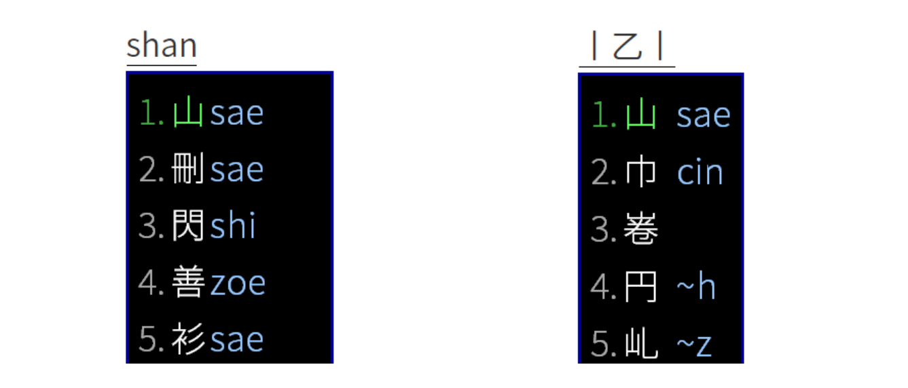

# 反查

如果不确定某个字在当地方言里的读音。吴语学堂的这些输入方案提供了两种形式的反查。一种是通过普通话反查，还有一种是通过笔画反查。按下`` ` ``键，就能使用汉语拼音进行反查。按下 `x`键，就可以使用笔画进行反查，笔画反查里分别用`hspnz`代表`一丨丿丶乙`这五种基本笔画。

比如使用宁波话输入法，想查找“山”字在宁波话中的读音。就可以按下`` ` ``键，输入`shan`，或是按下`x`输入`szs`。



反查主要是为了让使用者确定某个字的拼写，所以反查不显示声调。但以下这几种输入方案可以开启声调显示。

- [苏州](https://gist.github.com/shinzoqchiuq/8be2df56d04688445ada5f348fe61f68/archive/61e8576987bdcefcfc9a22f90ad717f0afb66ebb.zip)
- [桐乡](https://gist.github.com/shinzoqchiuq/4420f5e672452d599a6c66d9f4f361e9/archive/a640ae6b9d6e5eef5bc1440473a31933b7702b24.zip) [海盐](https://gist.github.com/shinzoqchiuq/c58f25754e7f3b5cac9f1956f4321a22/archive/c28fc340352c34843f32df01bcb65590ee580f95.zip) [嘉兴](https://gist.github.com/shinzoqchiuq/2dc859c9e217f712b1db10b9c2717781/archive/42937d45c2396d122125c8fb5a10cd9d0c3aae2b.zip) [嘉善](https://gist.github.com/shinzoqchiuq/f650afa63fada227fc07f8150c161987/archive/5c08a310b28ae15bd98a3435294ac52d153d8327.zip)
- [宁波](https://gist.github.com/shinzoqchiuq/bec778d687f54140d9c92c301e5b3dcc/archive/0e05593e6523ac3af247d6fb12368820746fc4f8.zip) [鄞县钟公庙](https://gist.github.com/shinzoqchiuq/16b8e0c521371decaf94df969bbe1e1e/archive/159500ed7c0e5d116e94c68d33c8b4a97490bc9c.zip)

如果使用者需要，可以点击以上几个链接获取相应输入方案的模糊音定制模板。下载得到的是压缩文件，解压后可以看到一个`.custom.yaml`结尾的文件。用记事本或其他文本编辑器打开它。

模糊音模板文件内，会有「反查標註設置」这一节。想要开启声调显示，可以删去这一小节下这行代码前的 # 号
````yaml
    #- xlit/12345678/¹²³⁴⁵⁶⁷⁸/
````
同时在下面这行前面加上 # 号
````yaml
    - xform/\d//
````
更改完后，记得保存。保存好之后，将文件放到Rime输入法的用户文件夹中。Windows系统下用户文件夹的位置在`%APPDATA%\Rime`，Mac OS下是`~/Library/Rime`，Linux下是`~/.config/ibus/rime`。Windows下也可以通过右键任务栏上的Rime图标来找到用户文件夹。

将文件放入用户文件夹之后，右键Rime图标点击“重新部署”。稍等一会儿就能生效了。

更多定制方法，请参照Rime的[定制指南](<https://github.com/rime/home/wiki/CustomizationGuide#定製指南)。
