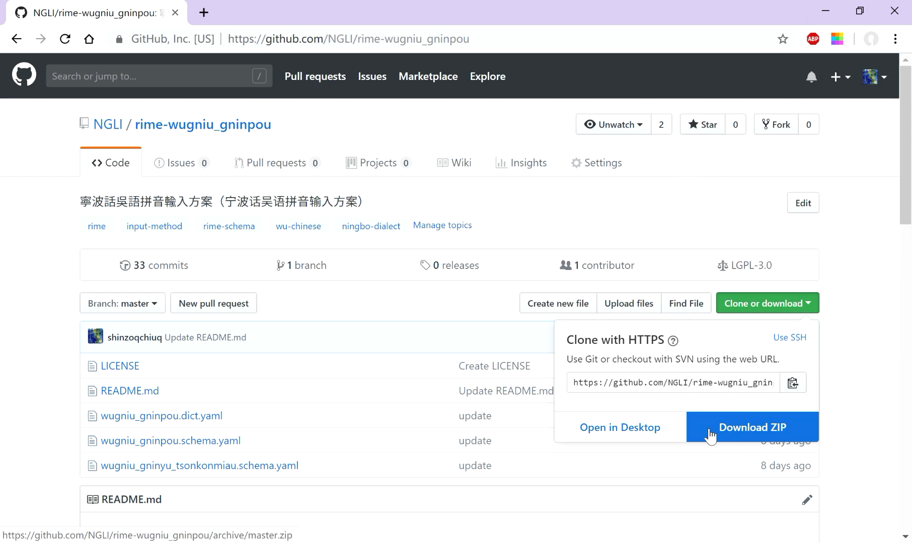

# Android

1. 安装同文输入法。具体可以参照Trime的[网站](https://github.com/osfans/trime)。

2. 到各个输入法的主页面，点击“Download”，选择“Download Zip”下载文件。

    

3. 解压下载好的压缩包，找到以`.yaml`结尾的文件，将它们放到`/sdcard/rime`文件夹。

4. 放好后，点击输入法图标。选择“输入”>“方案”，根据自己的需要勾选输入方案。选完点“确定”，等待一段时间。

5. 长按输入法左下角“選單”，在选单中选择输入法。

有需要的话，也可以参阅Rime输入法的[文档](https://rime.im/docs/)。