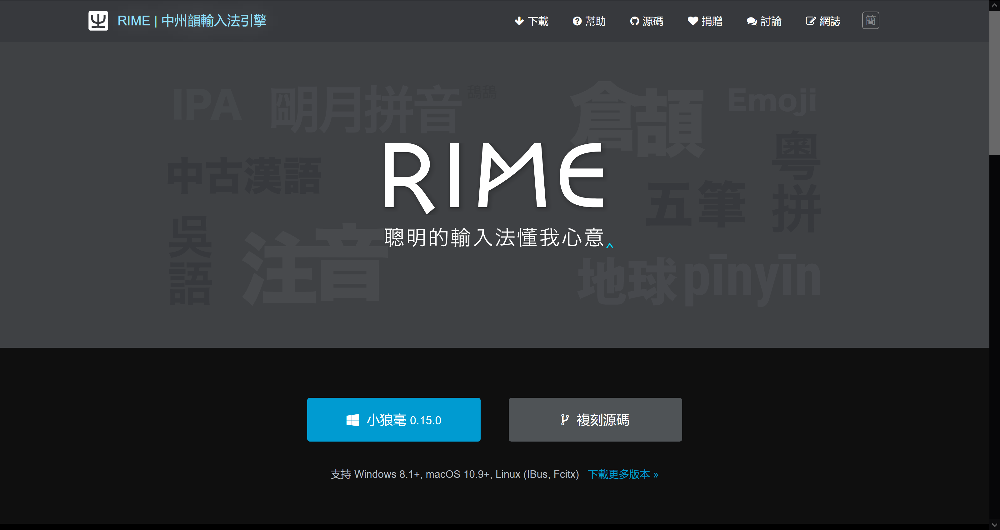
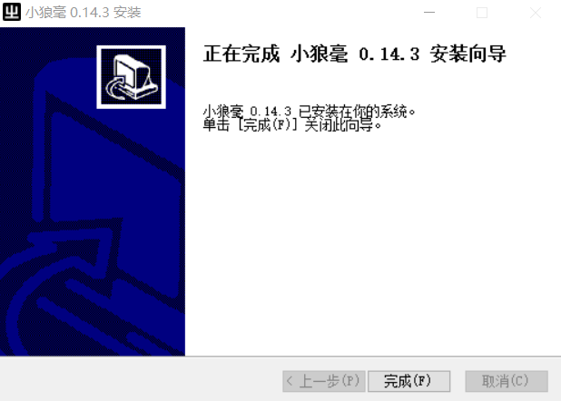
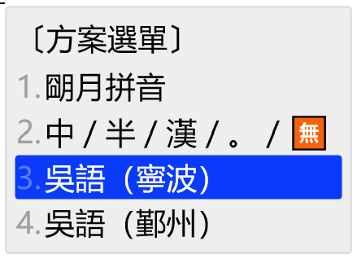

# Windows下安装方法

### 安装时添加输入方案

1. 打开 Rime 输入法的网站 https://rime.im/ ，点击小狼毫的图标下载输入法的安装包。当前版本为 0.14.3。

    

2. 下载好安装包之后，双击安装。

    如果弹出警告，点开“更多信息”选择“仍要运行”。（下图是安装 0.13.0 版时截的图，0.14.3 版类似）

    

    同意许可证，选择安装位置。点击“安装”。

    

    

3. 如果是第一次安装，安装进行到一半的时候，会弹出“【小狼毫】安裝選項”的界面。这里可以设定将输入法安装到哪种系统语言下，也可以自定义用户文件夹的位置。这里建议使用默认位置，避免给之后安装输入方案带来不必要的麻烦。选择完后点击“安裝”。

    

4. 稍等一段时间，等到安装程序提示成功。点击“完成”结束安装。

    

5. 点击在任务栏上输入法的图标，选择小狼毫。

    

    选择好之后，打开任何一个编辑器或输入框，按 `F4` 或 `` Ctrl+` `` 唤出“方案選單”，可以发现选单中已经有了几种输入方案。如果没有更多需求的话，就可以选一种打字了。

    

### 添加输入方案 / 更新输入方案

如果需要添加更多输入方案，可以参照以下步骤。

1. 在任务栏 Rime 图标这边右键打开菜单。

    

2. 打开后选择“輸入法設定”，就能进入“【小狼毫】方案選單設定”的界面。点击下方的“獲取更多輸入法方案...”。

    

3. 点完会弹出一个命令行界面。在这个命令行中输入仓库的地址。仓库地址在输入方案网页的左上角。注意是输入**仓库地址**，而非输入方案的名称。

    

    比如要安装宁波话输入法，就可以输入 `NGLI/rime-wugniu_gninpou`。

    输入完按下回车，等待一段时间。

    

4. 等到命令行界面不再变化，就可以关掉命令行界面了。再回到“【小狼毫】方案選單設定”的界面，可以发现输入法选单多了几种输入法。可以点击输入法的名字查看输入法的简介，然后根据个人需要勾选。选完点击“中”。

    

    之后是介面風格設定，选择一个自己喜欢的配色即可。选完点击“中”。

    

5. 完成后，再次右键任务栏 Rime 图标打开菜单，选择“重新部署”。稍等一会儿，待其部署完成即可。

    

    这种方法可以用于添加或更新输入方案。更新输入方案时，有可能出现更新失败的情形。可以到用户文件夹下，将已有的输入法文件删除。再试着重新安装一遍输入方案。

6. 安装完输入方案后，打开任何一个编辑器或输入框，按 `F4` 或 `` Ctrl+` `` 唤出“方案選單”，从选单中选择想要的输入法。开始打字。

    

### 视频教程：

以下两个视频教程是以版本 0.13.0 为例讲解的，与当前版本的安装方法有差异，仅供参考。

https://www.bilibili.com/video/av43252366

https://www.bilibili.com/video/av49332534

有需要的话，也可以参阅Rime输入法的 [文档](https://rime.im/docs/)。
