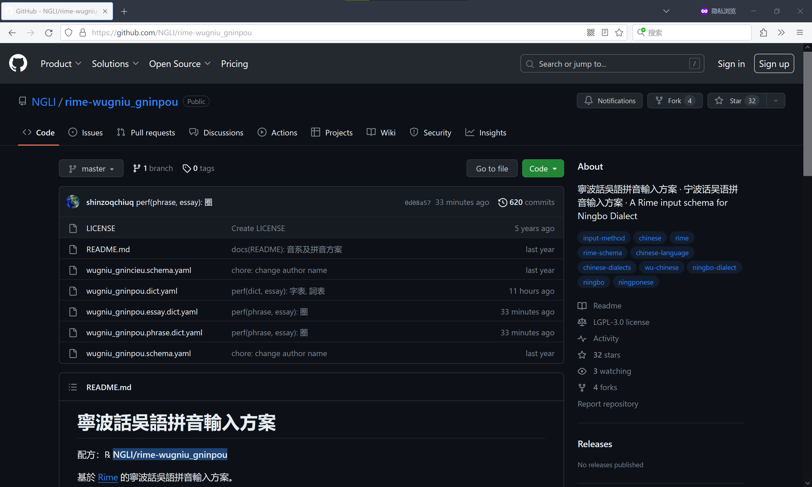

# Windows下安装方法

## 安装时添加输入方案

1. 打开Rime输入法的网站https://rime.im/ ，点击小狼毫的图标下载输入法的安装包。

    

2. 下载好安装包之后，双击安装。

    如果弹出警告，点开“更多信息”选择“仍要运行”。

    

    同意许可证，选择安装位置。点击“安装”。

    

    

3. 如果是第一次安装，安装进行到一半的时候，会弹出“【小狼毫】方案選單設定”的界面。我们点击下方的“獲取更多輸入法方案...”。

    

4. 点完会弹出一个命令行界面。在这个命令行中输入仓库的地址。仓库地址在输入方案网页的左上角。

    

    比如要安装宁波话输入法，就可以输入`NGLI/rime-wugniu_gninpou`。

    输入完按下回车，等待一段时间。

    

5. 等到命令行界面不再变化，就可以关掉命令行界面了。再回到“【小狼毫】方案選單設定”的界面，可以发现输入法选单多了几种输入法。可以点击输入法的名字查看输入法的简介，然后根据个人需要勾选。选完点击“中”。

    

    之后是介面風格設定，选择一个自己喜欢的配色即可。选完点击“中”。

    

    

6. 再稍等一段时间，等到安装程序提示成功。点击“完成”结束安装。

    

7. 点击在任务栏上输入法的图标，选择小狼毫。

    

    选择好之后，打开任何一个编辑器或输入框，按`F4`或`` Ctrl+` ``唤出“方案選單”，从选单中选择想要的输入法。开始打字。

    

## 安装后添加输入方案

如果安装完成后想再添加一些输入方案。可以在任务栏Rime图标这边右键打开菜单。

打开后选择“輸入法設定”，就能进入“【小狼毫】方案選單設定”的界面。之后只要重复前面第三步往后的操作即可。

视频教程：https://www.bilibili.com/video/av43252366

有需要的话，也可以参阅Rime输入法的[文档](https://rime.im/docs/)。